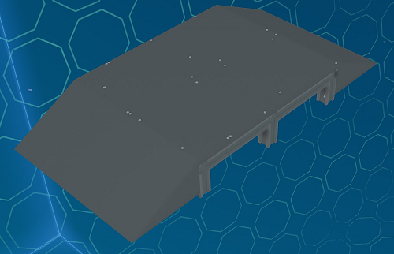
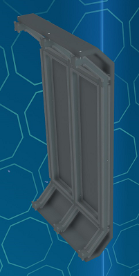
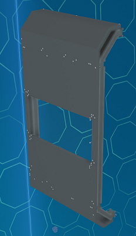
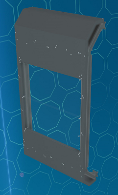

# Hull Modules

Basic modules consist of module that cover the main body with plates.

## Top/Bottom Cover Modules

The top/bottom cover modules cover the top and bottom of the body with plates. Rotate the module to use between the top and bottom
and connect in a row to cover the body lengthwise.

_Fig: Body 4U S Top/Bottom Cover Module_

**Available Sizes:** 4U S, 8U S

## Side Cover Modules

The side cover modules cover the sides of the body with plates. Rotate the module to use between the two sides of the body
and connect in a row to cover the body lengthwise.

_Fig: Body 4U S Side Cover Module_

**Available Sizes:** 4U S

## Side Window Modules

The side window modules are similar to the cover modules except they have windows. Rotate the module to use between the two sides of the body
and connect in a row to cover the body lengthwise. They can be used in conjunction with the cover modules.

_Fig: Body 4U S Side Window Modules_

**Available Sizes:** 4U S

**Variants:** Small, Large
