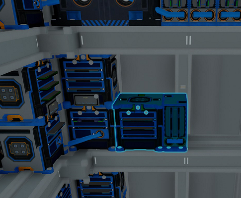

# Advanced Installation Steps

## Installing Additional YOLOL Racks or Memory Relays

Some modules come with additional YOLOL racks and/or memmory relays.
To install them just bolt them on the shelves provided in the front section of the ship bedhing the generator blocks.
Make sure they are touching another installed rack to ensure they have a data connection.

_Fig: Installed YOLOL rack and memory relay_
