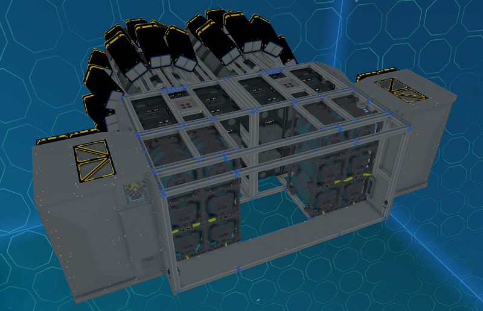
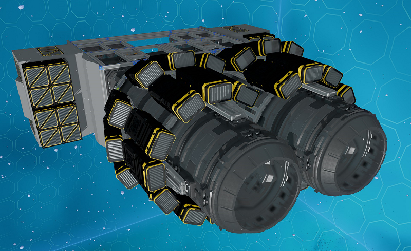
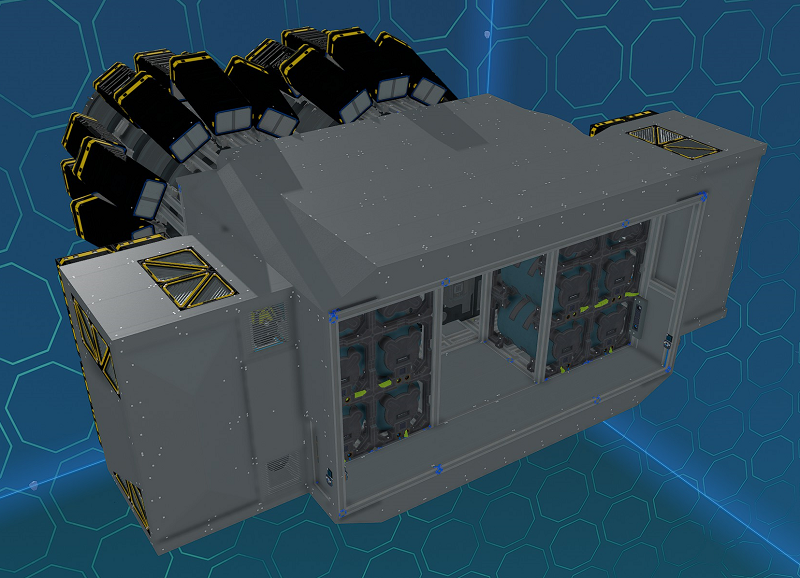

# Constructing the Back

The back section houses the rear thrusters (including double five ring plasma thrusters), half the maneuver thrusters, four of the navigation receivers, propellant and batteries.

_Fig: Ship Back Section_

Various parts of the back section can be extended with modules.

_Fig: Ship Back Section with Modules_

There is a service door on each side to provide access to this section once the ship is fully covered.
