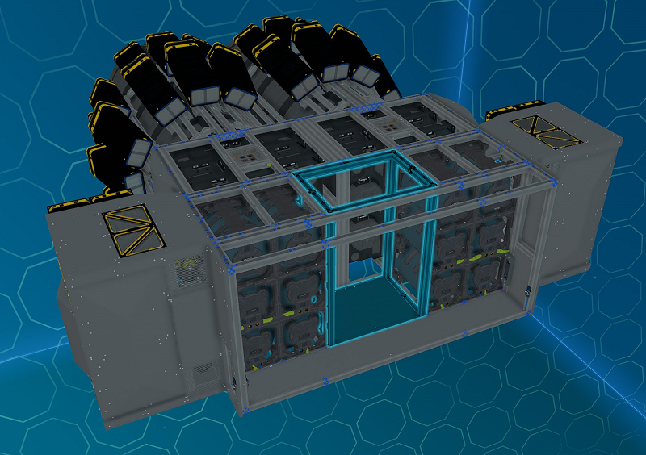
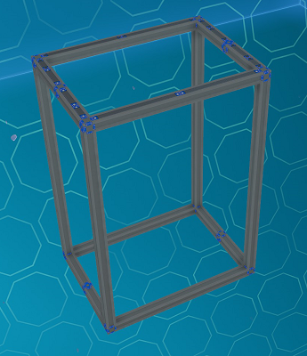
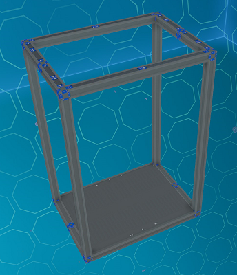
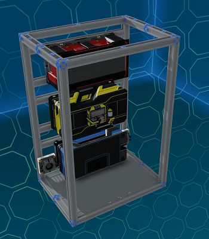
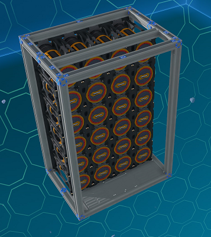
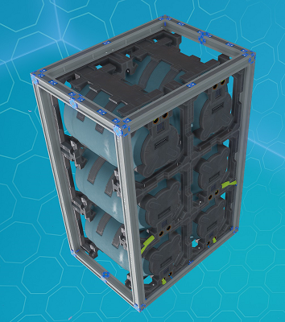

# Back Inner Modules

_Fig: Back Inner Module Location_

## Back Inner Shell Module

The back inner shell module consists of only the beams and ducts for power and pipe connections.

_Fig: Back Inner Shell Module_

## Back Inner Empty Module

The back inner empty module is the same as the shell module except it comes with Ajatite thin floor plates for flooring.

_Fig: Back Inner Empty Module_

## Back Inner Benches Module

The back inner benches module is the same as empty module except it comes with the basic bench (with meter upgrade), advanced bench and tools bench.
It also has two resource bridges for access to any ore crates on the ship.

_Fig: Back Inner Benches Module_

## Back Inner Fuel Module

The back inner propellant module is the same as empty module except it comes with 24 T2 fuel rods on racks.

_Fig: Back Inner Fuel Module_

:::tip

If this module is installed, adjust the `MBR` field on the `BackupRods` progress bar with an additional 24 rods so the `WithBackup` fuel time is calculated with these rods included.

:::

## Back Inner Propellant Module

The back inner propellant module is the same as empty module except it comes with six large propellant tanks.

_Fig: Back Inner Propellant Module_
