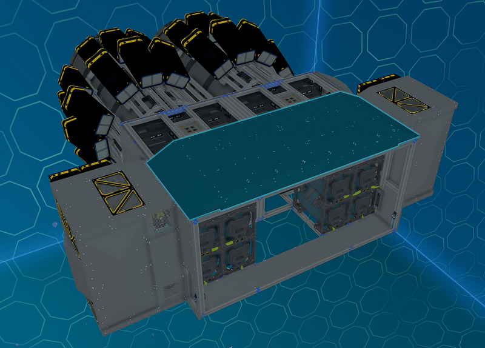
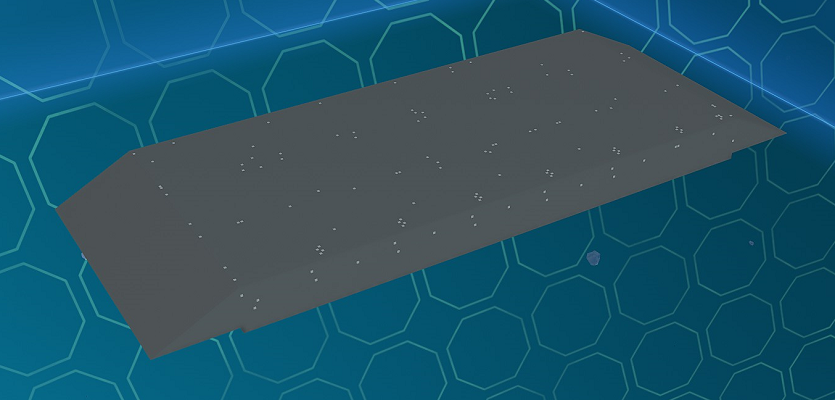

# Back Top/Bottom Modules

_Fig: Back Top/Bottom Module Location_

## Back Top/Bottom Cover Module

The back top/bottom cover module covers the top and bottom of front section of the ship back with plates.
Rotate the module to use between the top and bottom.

_Fig: Back Top/Bottom Cover Module_
