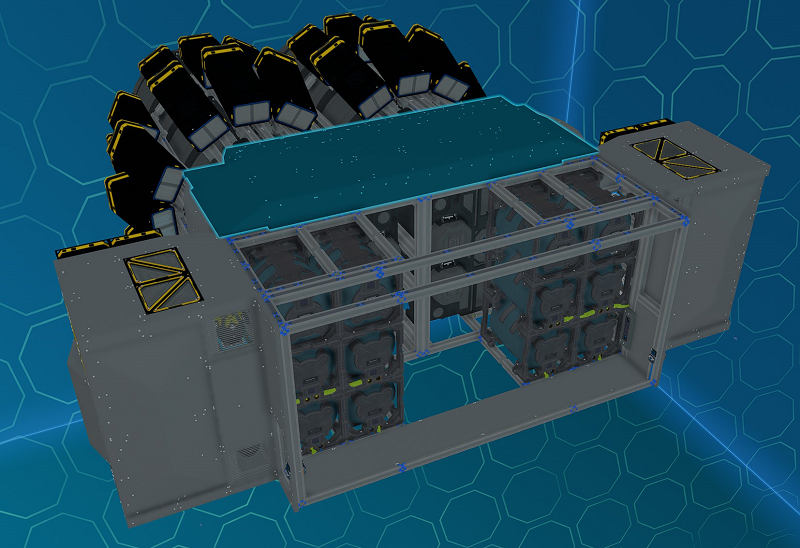
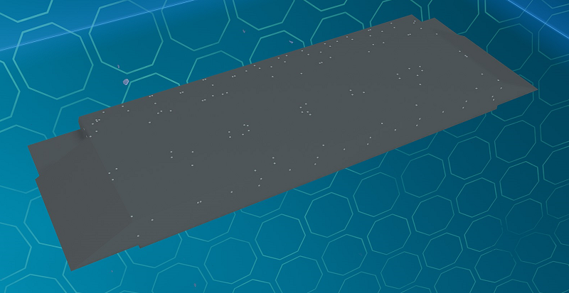
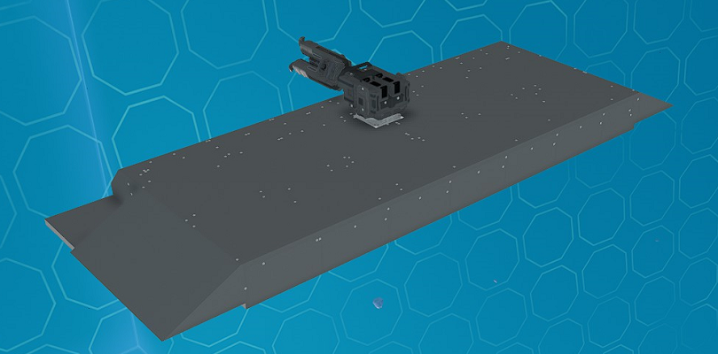

# Back Top/Bottom End Modules

_Fig: Back Top/Bottom End Module Location_

## Back Top/Bottom End Cover Module

The back top/bottom end cover module covers the top and bottom of back section of the ship back with plates.
Rotate the module to use between the top and bottom.

_Fig: Back Top/Bottom End Cover Module_

## Back Top/Bottom End Tow Module

The back top/bottom end tow module is similar to the cover module except with has a tow beam installed.
Rotate the module to use between the top and bottom.

Instructions on how to use the tow beam is available [here](../../flying/modules/tow).

:::info Additional Installation Steps

This module comes with a yolol rack and an memory relay that needs to be installed.
For more information see the instructions [here](../advanced#installing-additional-yolol-racks-or-memory-relays).

The provided buttons and progress bars can be bolted any where on the pilot console.

:::

_Fig: Back Top/Bottom End Tow Module_
