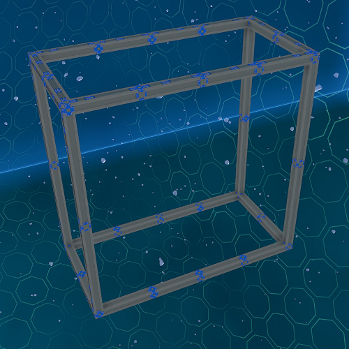
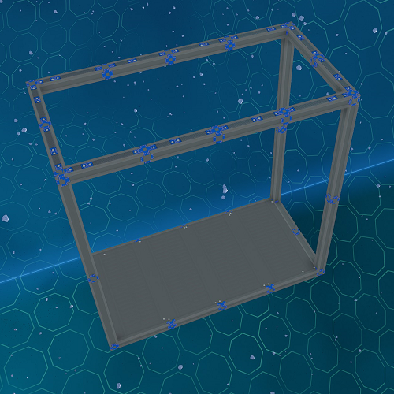

# Basic Modules

Basic modules consist of shell modules and empty modules.

## Shell Modules

Shell modules consists of only the beams and ducts for power and pipe connections.
All modules should be based of these modules can be used for the basis of creating your own custom modules.

**Available Sizes:** 4U S, 4U M, 4U L, 4U XL, 8U S, 8U M, 8U L, 8U XL

_Fig: Body 4U S Shell Module_

## Empty Modules

Empty modules are the same as shell modules except they come with Ajatite thin floor plates for flooring.

**Available Sizes:** 4U S, 4U M, 4U L, 4U XL, 8U S, 8U M, 8U L, 8U XL

_Fig: Body 4U S Empty Module_
