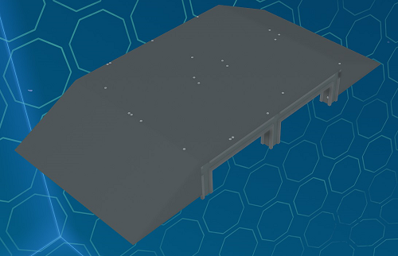

# Hull Modules

Basic modules consist of modules that cover the main body with plates.

## Top/Bottom Cover Modules

The top/bottom cover modules cover the top and bottom of the body with plates. Rotate the module to use between the top and bottom
and connect in a row to cover the body lengthwise.

The end variant is used at the ends of the body section.

_Fig: Body 4U S Top/Bottom Cover Module_

**Available Sizes:** 4U S, 8U S

**Variants:** Normal, End (8U only)

## Side Cover Modules

The side cover modules cover the sides of the body with plates. Rotate the module to use between the two sides of the body
and connect in a row to cover the body lengthwise. They can be used in conjunction with the other hull modules.

The end variant is used at the ends of the body section.

_Fig: Body 4U S Side Cover Modules_

**Available Sizes:** 4U S

**Variants:** Normal, End

## Side Window Modules

The side window modules are similar to the cover modules except they have glass windows. Rotate the module to use between the two sides of the body
and connect in a row to cover the body lengthwise. They can be used in conjunction with the other hull modules.

_Fig: Body 4U S Side Window Modules_

**Available Sizes:** 4U S

**Variants:** Small, Large

## Side Door Modules

The side door modules provide powered ramp doors for access into the ship body.
They have port and starboard side variants and can be used in conjunction with the other hull modules.

_Fig: Body 4U M Side Door Module_

**Available Sizes:** 4U S, 4U M, 4U L, 4U XL

**Variants:** Port, Starboard

:::info Adding Additional Buttons

For any additional buttons you would like to add to the ship for these doors, use the following values.

| Original Field Name | New Field Name | Value |
|---|---|---|
| `ButtonState` | `Port` or `Starboard` | 0 |
| `ButtonOnStateValue` | - | 1 |
| `ButtonOffStateValue` | - | 0 |
| `ButtonStyle` | - | 1 |

:::

## Side Adapter Module

The side adapter module allow 4U width bodies to connect to the back and front sections of the ship.
They can be used in conjunction with the other hull modules.

_Fig: Side Adapter Module_

**Available Sizes:** 4U S
