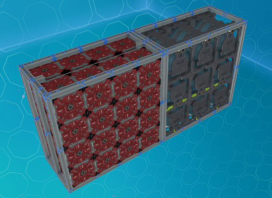
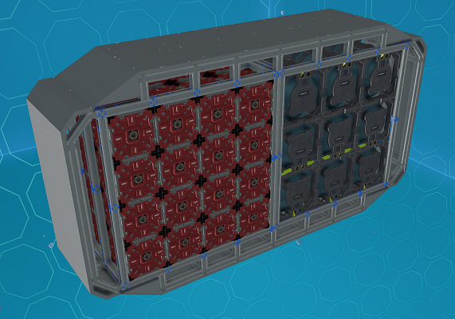
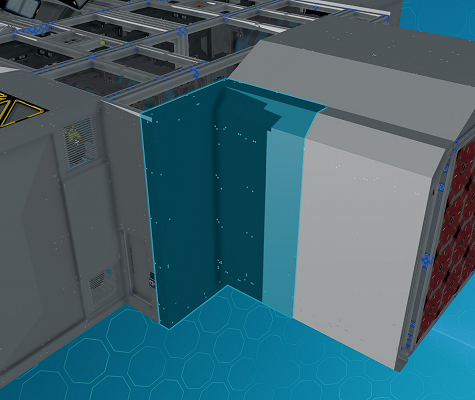

# Constructing the Body

The body section is put together by welding together a series of modules of different sizes.

## Module Sizes

The size of the modules are measured using units of 144cm (known as U).

:::note

Strictly speaking though one U is not always exactly 144cm as there are some additinal space used for 24cm beams depending on the module.

:::

The width (sideways in relation to the ship) of the body modules come in two different sizes - 4U and 8U.

The length (lengthwise in relation to the ship) come in four sizes - S (2U), M (4U), L (6U) and XL (8U).

## Body Layout

The total width of the body can be 4U and 8U. There are restrictions in place to maintain the ease of use of the modules.

4U bodies can only be put together using 4U modules.

8U bodies can be put together either using one 8U module or using two 4U modules.

_Fig: Two 4U Modules make a 8U Module_

The body then can be covered using [hull modules](./body-section/hull) that go on the side as well as top and bottom to complete the body.

_Fig: Body covered with Hull Modules_

There is no limit to the length of the body except that you will probably hit some game limits, plus the ship will get slower and slower.

:::info Body Height

The intention is to keep the main body at a fixed height of 4U with the current modules,
although it is possible to extend it with custom modules.

:::

## Connecting to the Back and Front Sections

The back and front section have connections for up to 8U in wdith.
If your body is less that 8U, there is the [adapter hull module](./body-section/hull#side-adapter-module) that can be used to bridge the gap.

_Fig: Using Hull Adapter Module_
