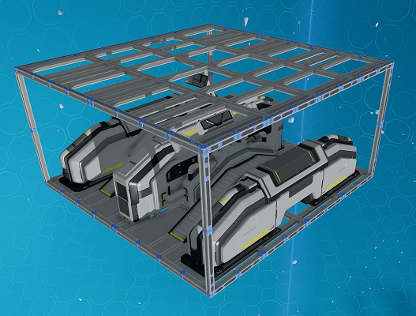

# Utility Modules

Utility modules consist of modules that provide extra features to a ship.

## Crates Module

The crates module provides ore crates to the ship. It will add 32 crates into the ship's network for each module used.

_Fig: Body 4U S Crates Module_

**Available Sizes:** 4U S

## Propellant Module

The propellant module provides additional propellant to the ship.
It will add 81,000,000 units of propellant into the ship's network for each module used.

_Fig: Body 4U S Propellant Module_

**Available Sizes:** 4U S

:::info

The `Propellant` display in the cockpit should automtically update with the full ship network's propellant when the module is used.

:::

## Nav Logger Module

The nav logger module provides a navigation logger to the ship.

_Fig: Body 8U XL Nav Logger Module_

**Available Sizes:** 8U XL
