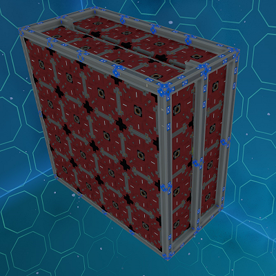
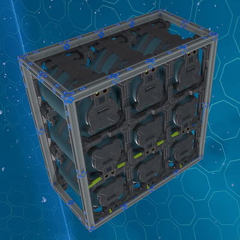

# Utility Modules

Utility modules consist of modules that provide extra features to a ship.

## Crates Modules

The crates modules provide ore crates to the ship.

_Fig: Body 4U S Crates Module_

**Available Sizes:** 4U S

## Propellant Modules

The propellant modules provide additional propellant to the ship. It will add propellant into the ship's network.

_Fig: Body 4U S Propellant Module_

**Available Sizes:** 4U S
