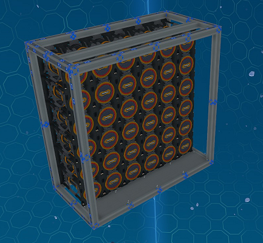

# Utility Modules

Utility modules consist of modules that provide extra features to a ship.

## Crates Module

The crates module provides ore crates to the ship. It will add 32 crates into the ship's network for each module used.

_Fig: Body 4U S Crates Module_

**Available Sizes:** 4U S

## Propellant Module

The propellant module provides additional propellant to the ship.
It will add 81,000,000 units of propellant into the ship's network for each module used.

_Fig: Body 4U S Propellant Module_

**Available Sizes:** 4U S

:::info

The `Propellant` display in the cockpit should automtically update with the full ship network's propellant when the module is used.

:::

## Fuel Module

The fuel module provides extra fuel rods on racks. It will add 36 T2 fuel rods for each module used.

_Fig: Body 4U S Fuel Module_

**Available Sizes:** 4U S

## Generators Module

The generator module provides six extra T3 fuel chambers supporting 18 additional T3 generator units with a T2 enhancer each.
It also has additional heat sinks and the base ship has enough radiators to support use of a single generators module.

:::info Additional Installation Steps

This module comes with a yolol rack and an memory relay that needs to be installed.
For more information see the instructions [here](../advanced#installing-additional-yolol-racks-or-memory-relays).

:::

_Fig: Body 4U S Generators Module_

**Available Sizes:** 4U S

:::caution

Only a single generators module can be used without making manual changes.
Any additional generators modules will also require extra radiators.

:::

## Nav Logger Module

The nav logger module provides a navigation logger to the ship.

_Fig: Body 8U XL Nav Logger Module_

**Available Sizes:** 8U XL

## Seats Module

The seats module provides seats for passengers with space for walking in between. It will add eight seats for each module used.

_Fig: Body 4U S Seats Module_

**Available Sizes:** 4U S
