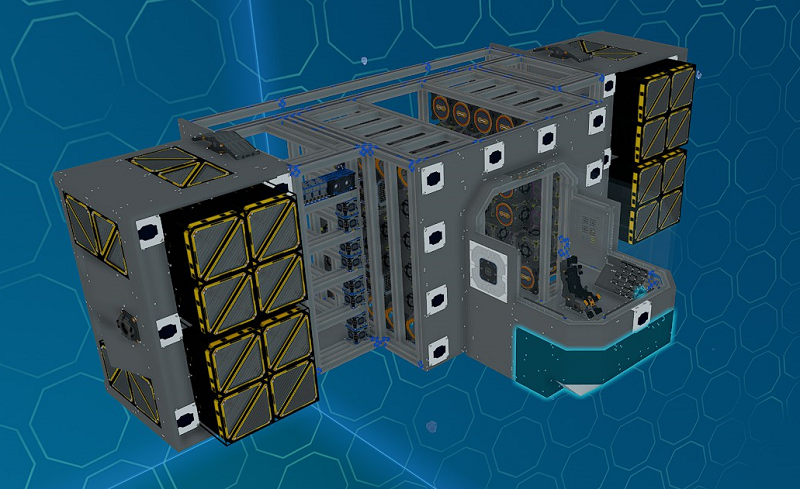

# Front Cockpit Modules

_Fig: Front Cockpit Module Location_

## Front Cockpit Cover Module

The front cockpit cover module covers bottom of the cockpit with plates.

_Fig: Front Cockpit Cover Module_

## Front Cockpit Collectors Module

The front cockpit collectors module adds two ore collectors into the nose of the cockpit.

This module goes well with the [front side lasers module](./side#front-side-lasers-module).

:::info Additional Installation Steps

The provided button can be bolted any where on the pilot console.

:::

_Fig: Front Cockpit Collectors Module_
