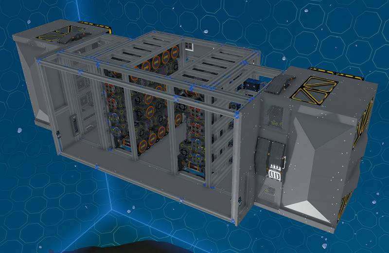
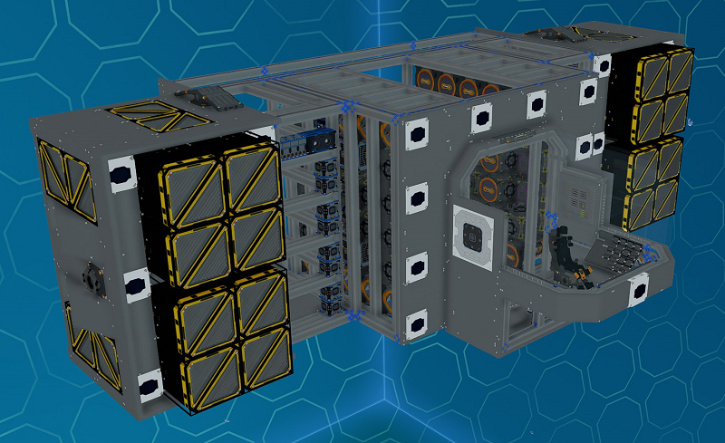
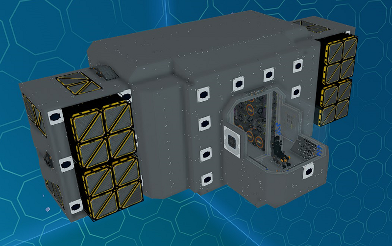

# Constructing the Front

The front section houses the front thrusters, half the maneuver thrusters, two of the navigation receivers, generators, cooling, YOLOL and the cockpit.

_Fig: Ship Front Section_

Various parts of the front section can be extended with modules.

_Fig: Ship Front Section with Modules_

There is a door on each side to provide access to this section once the ship is fully covered.
