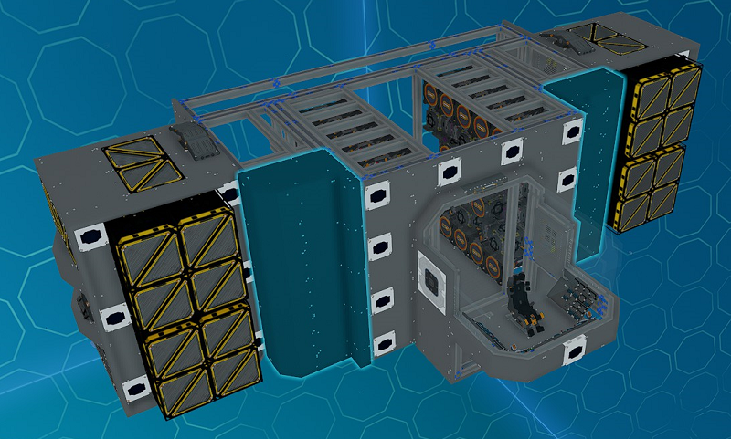
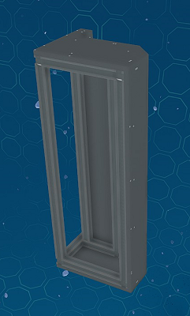
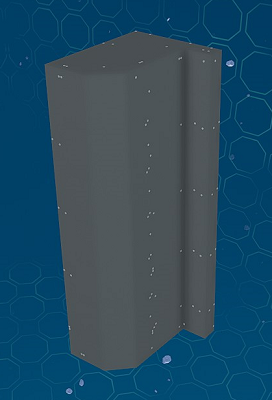

# Front Side Modules

_Fig: Front Side Module Location_

## Front Side Cover Module

The front side cover module covers each side of the ship face on either side of the cockpit with plates.
Rotate the module to use between the top and bottom.

_Fig: Front Side Cover Module_
