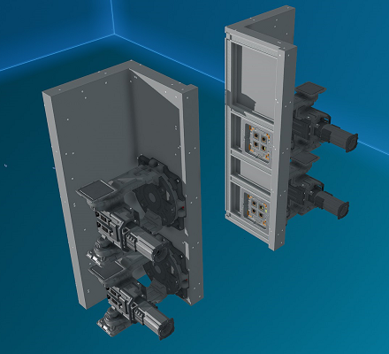

# Front Side Modules

_Fig: Front Side Module Location_

## Front Side Cover Module

The front side cover module covers each side of the ship face on either side of the cockpit with plates.
Rotate the module to use between the top and bottom.

_Fig: Front Side Cover Module_

## Front Side Lasers Module

The front side lasers module come in a pair, one for each side and provide four mining lasers.
When activated the lasers will converge on the target of the `Range` laser.

This module goes well with the [front cockpit collectors module](./cockpit#front-cockpit-collectors-module).

:::info Additional Installation Steps

This module comes with a yolol rack that needs to be installed.
For more information see the instructions [here](../advanced#installing-additional-yolol-racks-or-memory-relays).

The provided button can be bolted any where on the pilot console.

:::

_Fig: Front Side Lasers Module_
