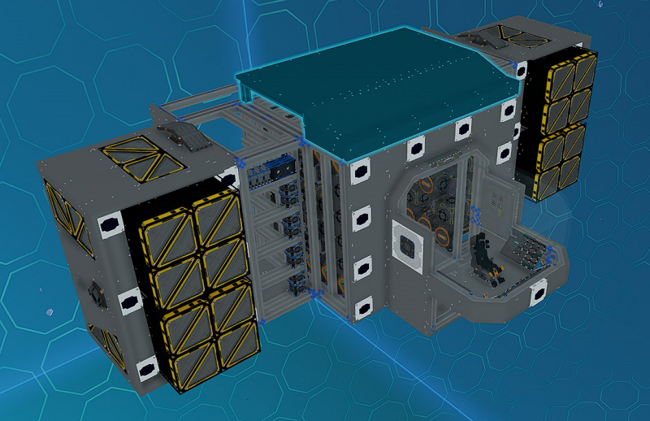
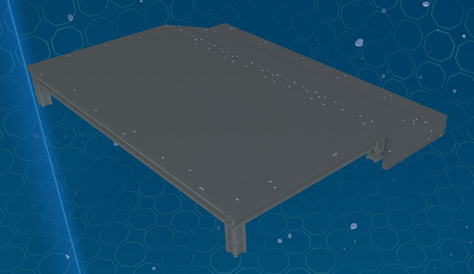

# Front Top/Bottom Modules

_Fig: Front Top/Bottom Module Location_

## Front Top/Bottom Cover Module

The front top/bottom cover module covers the top and bottom of middle section of the ship front with plates.
Rotate the module to use between the top and bottom.

_Fig: Front Top/Bottom Cover Module_
