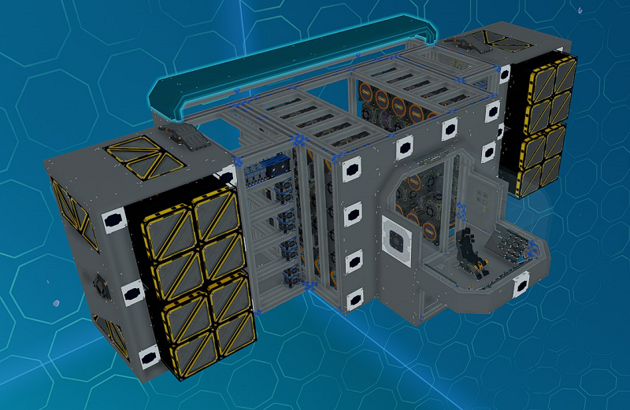
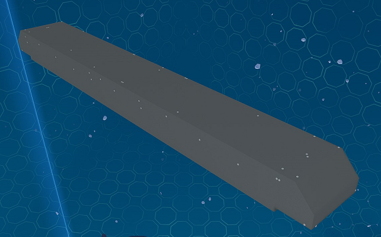

# Front Top/Bottom End Modules

_Fig: Front Top/Bottom End Module Location_

## Front Top/Bottom End Cover Module

The front top/bottom end cover module covers the top and bottom of back section of the ship front with plates.
Rotate the module to use between the top and bottom.

_Fig: Front Top/Bottom End Cover Module_
