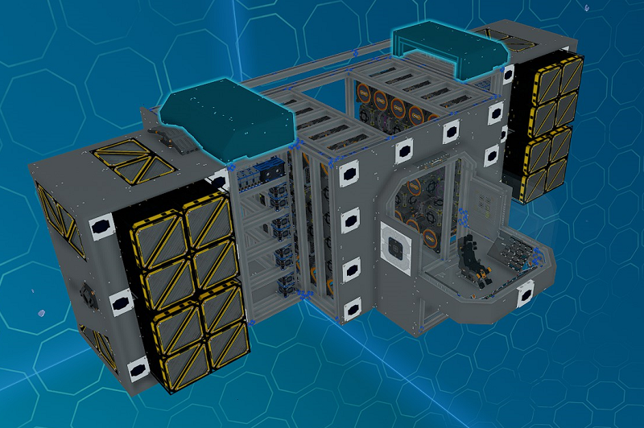
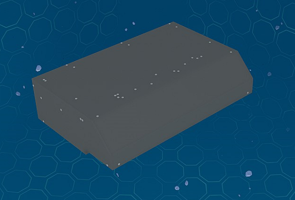

# Front Top/Bottom Side Modules

_Fig: Front Top/Bottom Side Module Location_

## Front Top/Bottom Side Cover Module

The front top/bottom side cover module covers the top and bottom of each side of the ship front with plates.
Rotate the module to use between the top and bottom.

_Fig: Front Top/Bottom Side Cover Module_
