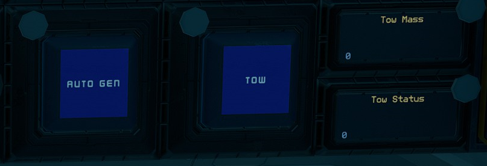

# Using the Tow Module

| Interface | Function |
|---|---|
| `Tow Status` | Status of tow beam, `0` is off, `1` is on and `2` is locked on. |
| `Tow Mass` | Mass of locked on ship, in kilograms. |
| `Tow` | Activates the tow beam. |
| `Auto Gen` | Activates `Min Gen` with `Min Generator Limit` according to `Tow Mass`. |

Activate `Tow` to turn on the tow beam. Once the tow beam is locked on the ship, the `Tow Status` will be `2` and the mass of the locked ship will be shown as `Tow Mass` in kilograms.
Activate `Auto Gen` which will then turn on `Min Gen` with a `Min Generator Limit` based off the `Tow Mass`. Wait till the generators reach the targeted rate before flying off.

For large ships, it is recommended to turn on `Min Gen` to ramp up the generator before locking on and then activating `Auto Gen` once locked on to adjust the `Min Generator Limit` accordingly.

:::caution

Remember to turn off `Min Gen` after towing to save on fuel.

:::
