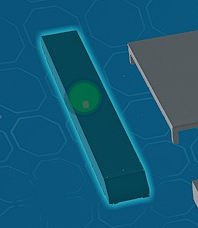
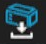
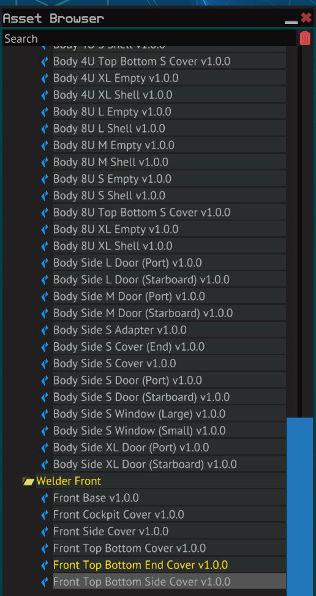

# Getting Started

## Download

Download the zip file containing the blueprint files for the modules [here](https://github.com/vinteo/starbase-ship-welder/raw/main/blueprints/framework/welder.zip).

## Loading the Modules

Loading the modules is the same as loading any other ship blue prints

1. Navigate to `%AppData%\Starbase\ssc\autosave\shipblueprints`. If autosave folder does not exist spend some time (default is 5 minutes, this can be reduced in the settings) in the Ship Designer to force an autosave.
2. Now here you will find files called ship_###.fbe The highest number will later be shown on top of the `autosaves` folder in the Ship Designer.
3. Copy the first .fbe module file into the folder and rename it with a higher number. For example if the highest numbered file is `ship_123.fbe`, rename it `ship_124.fbe`.
4. Go into the Ship Designer, select `File` -> `Open or manage blueprints`. From the dialog, there should be an `Autosave` group. The one you copied in manually will now be shown with a **blank** name.
5. Once the modules have loaded, select `File` -> `Save` and save a copy of the file for later use.
6. Repeat steps 3 to 5 for each of the module files.

## Saving as Individual Modules

Each of the files contain multiple modules. Once the module files have been saved, you can save the module individually for convenient usage.

1. Select a module by clicking on the module indicator (green circle).

   

2. Select the save module icon from the toolbar and name the module

   

   :::tip

   You can create folders in `My Modules` to organise your modules by right clicking on `My Modules` and selecting `Create Folder`

   :::

3. Repeat steps 1 and 2 for each module you want to use.

The saved modules should now appear in your `Assets Browser` under `My Modules`, select them to use in your blueprints.

_Fig: Asset Browser with Modules_
